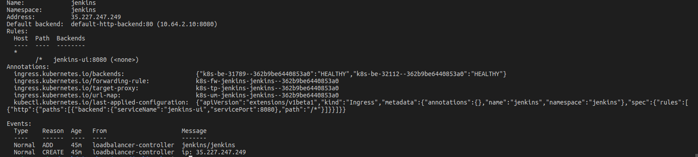
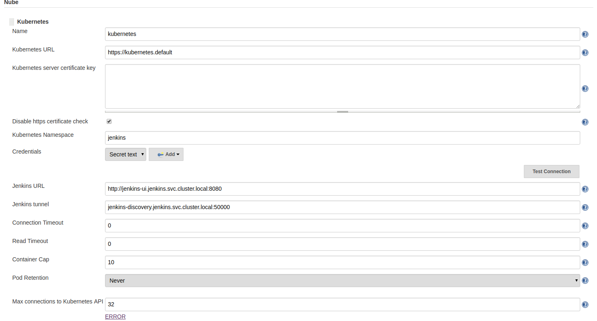
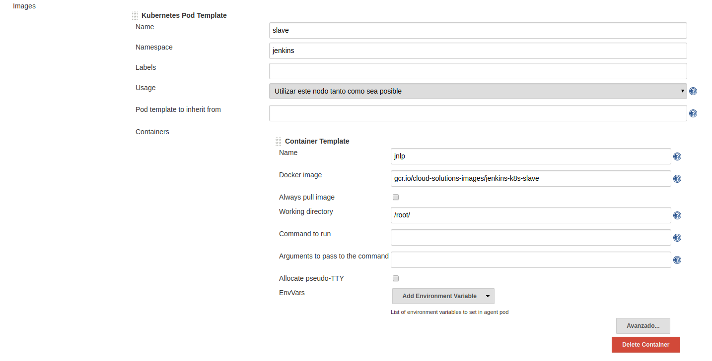
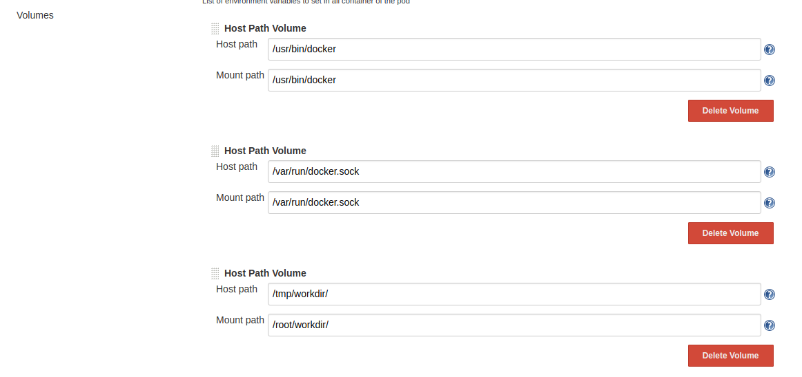
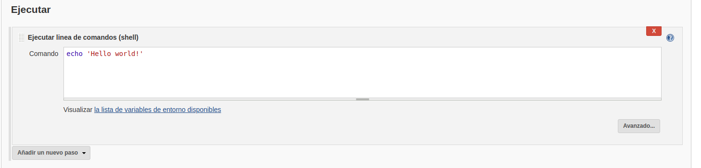
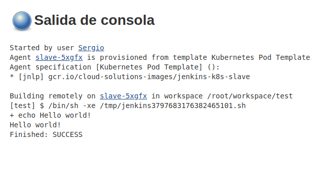

# Gcloud Installation
## Create a cluster
The first step is to go to the GCloud platform in the GKE section (Google Kubernetes Engine).

We create a cluster to our needs and we launch it. I'm going to use version 1.11.2-gke.9 for the kubernetes master.

For cluster permissions, I recommend creating a specific service account for the node pool with some basic permissions, after all we can add more permissions as we need.

**Important if you are going to use an ingress for external connections activate the default GCloud balancer.**

## Persistent Volumes
I'm going to use a gcePersistentDisk, for that I go to the compute engine -> disks section -> I create one with the name jenkins.

Recommendations:
- SSD
- 100 GB
- It is mandatory to be in the same region as the cluster.

## Kubernetes
We can modify the file kubernetes.yml.

By default:
- Alpine image
- gcePersistentDisk
- namespace: jenkins
- imagePullPolicy: Always
- Use of ingress

Exec:
```
$ kubectl apply -f kubernetes.yml
```

**The ingress may take up to 10 minutes to become active.**

## Jenkins Installation
If we want to see the ip that we have assigned to external traffic we execute:

```
$ kubectl -n jenkins describe ingress jenkins
```

- -n : namespace
- jenkins : Ingress name



When we enter Jenkins will ask for the admin password. In order to know the password we introduce the following in our console:
```
$ kubectl -n jenkins logs $(kubectl get pods --no-headers -o custom-columns=":metadata.name" -n jenkins)
```

We install the plugins we want. After this we go to Plugin Administration and add the plugin of Kubernetes and Google Authenticated Source.

Then we will follow the steps we have available [here](https://cloud.google.com/solutions/configuring-jenkins-kubernetes-engine).



Here I give you my configuration, because I have made some changes with respect to the link that I have added previously.

If we click Test Connection we'll get an error. The simplest solution is to enter the following command:
```
$ kubectl create clusterrolebinding jenkins-default --clusterrole cluster-admin --serviceaccount=jenkins:default
```

Another way is to run the next yml:
[**service-account.yml**](https://github.com/jenkinsci/kubernetes-plugin/blob/master/src/main/kubernetes/service-account.yml)






## Last step

We create a job, make it run a command for example that shows hello world and try to launch it.






And we already have our jenkins up and running.